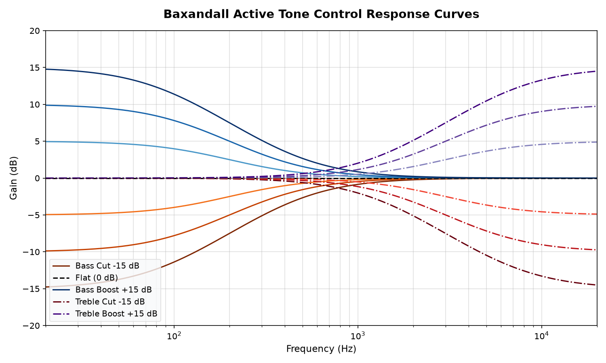

# Smart Analog Audio Amplifier with Touchless Gestural Control

A hybrid digital-analog audio amplification system combining an **ESP32-based digital audio engine** with a **classic Class-AB discrete power amplifier** and an **active Baxandall tone control stage**. The project features a touchless human-machine interface (HMI) using ultrasonic sensors to map hand gestures to real-time volume adjustments and speaker muting.

This project is a complete prototype showcasing digital-analog integration, FreeRTOS multitasking firmware design, and discrete analog circuit design.

---

## 🗺️ System Architecture

The system is split into two distinct sections to isolate high-frequency digital switching noise from the sensitive analog signal path:

1. **Digital Subsystem:** Reads MP3 files from a microSD card, decodes them in software, streams PCM audio over I2S to a dedicated DAC, and processes dual ultrasonic sensor inputs to adjust volume and control the output mute relay.
2. **Analog Subsystem:** Takes line-level analog audio, performs active frequency shaping (bass/treble shelves), boosts the voltage signal via a small-signal pre-driver, and drives a low-impedance speaker load through a complementary Class-AB output stage.

```mermaid
graph TD
    %% Styling Definitions
    classDef digital fill:#e8f4fd,stroke:#2196f3,stroke-width:2px,color:#0d47a1;
    classDef analog fill:#efebe9,stroke:#5d4037,stroke-width:2px,color:#3e2723;
    classDef control fill:#e8f5e9,stroke:#4caf50,stroke-width:2px,color:#1b5e20;

    subgraph Digital Domain ["Digital Control & Source (ESP32 Core)"]
        SD["FAT32 microSD Card"] -->|SPI: MP3 Stream| ESP32["ESP32 Dual-Core MCU"]
        US_VOL["HC-SR04 Vol Sensor"] -->|Pulse Timing| ESP32
        US_MUTE["HC-SR04 Mute Sensor"] -->|Pulse Timing| ESP32
        ESP32 -->|I2S PCM Stream| DAC["PCM5102A I2S DAC"]
    end

    subgraph Analog Domain ["Analog Signal Chain"]
        DAC -->|Line-Level Out| Tone["NE5532 Active Tone Stage<br/>(Baxandall EQ)"]
        Tone -->|EQ Output| Buffer["BC109BP Voltage Pre-Amp<br/>(VAS Stage)"]
        Buffer -->|Pre-Amplified Audio| Bias["2N3906 Vbe Multiplier<br/>(Class-AB Bias Control)"]
        Bias -->|Complementary Drive| Power["BD139 / BD140 Output Stage<br/>(Push-Pull Emitter Follower)"]
    end

    %% Control Loops
    ESP32 -->|GPIO Select| Relay["Mute Relay Module"]
    Power -->|AC-Coupled Audio (C5)| Relay
    Relay -->|Muted/Unmuted Audio| Speaker["8 Ω Loudspeaker"]

    %% Class Application
    class SD,ESP32,US_VOL,US_MUTE,DAC digital;
    class Tone,Buffer,Bias,Power,Speaker analog;
    class Relay control;
```

---

## 🔌 Analog Signal Chain Detail

The analog signal path is carefully designed for high fidelity, thermal stability, and low crossover distortion.

### 1. Active Tone Control Stage (NE5532)
Unlike passive RC filters which introduce significant insertion loss (often ~20 dB), this design utilizes an active **Baxandall tone control network** wrapped around a low-noise **NE5532** operational amplifier. 
- **Bass Control:** Utilizes a low-pass shelving filter that boosts or cuts frequencies below $200\text{ Hz}$ by up to $\pm15\text{ dB}$.
- **Treble Control:** Utilizes a high-pass shelving filter that boosts or cuts frequencies above $3\text{ kHz}$ by up to $\pm15\text{ dB}$.
- **Unity Mid-Point:** When both knobs are at center, the circuit acts as a flat-response buffer with unity gain.

### 2. Pre-Driver & Voltage Amplification Stage (BC109BP)
The output of the tone control is buffered and amplified by a **BC109BP** NPN transistor configured as a common-emitter pre-driver. This stage provides the necessary voltage gain (VAS) to drive the subsequent output stage and lowers the source impedance.

### 3. Biasing & Thermal Stabilization ($V_{BE}$ Multiplier)
A major challenge in discrete Class-AB amplifiers is **thermal runaway**: as output transistors heat up, their base-emitter turn-on voltage ($V_{BE}$) decreases, leading to increased collector current, further heating, and eventual device failure.
- **Biasing:** To eliminate crossover distortion, the bases of the output transistors must be biased approximately $1.4\text{V}$ to $1.8\text{V}$ apart.
- **The Regulator:** A $V_{BE}$ multiplier circuit is built using a **2N3906** PNP transistor and an adjustable trimmer (**PR1**), supplemented by two **1N4148** diodes. 
- **Thermal Tracking:** The 2N3906 and 1N4148 diodes are physically mounted in contact with the output transistor heatsink. As temperature increases, the bias voltage drops proportionally, dynamically stabilizing the idle current ($I_q \approx 20\text{--}100\text{ mA}$) and preventing runaway.

### 4. Complementary Push-Pull Output Stage (BD139 / BD140)
Power delivery is handled by a complementary push-pull pair:
- **BD139 (NPN):** Sources current to the load during the positive half-cycles of the audio waveform.
- **BD140 (PNP):** Sinks current from the load during the negative half-cycles.
- **Emitter Resistors ($R_9, R_10$):** $10\ \Omega$ power resistors stabilize the output transistors' operating points, enforce current sharing, and provide local negative feedback to minimize distortion.

### 5. Output AC-Coupling & Grounding
- **AC Coupling:** Since the power amplifier runs on a single $+15\text{V}$ supply rail, the output node sits at a DC offset of $\sim7.5\text{V}$ (half-supply). A large $2200\ \mu\text{F}$ capacitor ($C_5$) blocks this DC offset from the speaker, preventing damage while letting AC audio frequencies down to $20\text{ Hz}$ pass.
- **Star Grounding:** To eliminate ground loops, digital ground (ESP32), small-signal ground (NE5532), and high-current power ground (Class-AB stage) are connected at a single physical point (Star Ground), minimizing hum and noise.

---

## 💻 Software Architecture & FreeRTOS

The ESP32 firmware handles MP3 decoding and gestural HMI sensing concurrently.

### The Stuttering Problem
In standard single-threaded Arduino code, reading ultrasonic sensors with `pulseIn()` blocks execution for up to $30\text{ ms}$ per sensor. This periodic blocking starves the I2S audio buffer, causing severe, audible stuttering and choppiness.

### The Multi-Core Solution
The firmware is written using **FreeRTOS** to partition tasks across both ESP32 cores:
- **Core 1 - `AudioPlaybackTask` (Priority 5 - High):** Calls `audio.loop()` continuously. This task receives maximum CPU allocation to ensure I2S DMA buffers are kept full, ensuring completely glitch-free playback.
- **Core 0 - `SensorControlTask` (Priority 1 - Low):** Runs at $10\text{ Hz}$ (every $100\text{ ms}$). It triggers the sensors, reads the pulse durations, applies filtering, and modifies the volume level.
- **Task Synchronization:** A FreeRTOS `Mutex` ensures thread-safe updates when the sensor task writes a new volume value to the shared `Audio` instance.

### Signal Smoothing (Exponential Moving Average)
To eliminate jitter and sudden volume jumps from ultrasonic reflections, sensor data is smoothed using an Exponential Moving Average (EMA) filter:

$$y[n] = \alpha \cdot x[n] + (1 - \alpha) \cdot y[n-1]$$

Where:
- $x[n]$ is the raw sensor reading.
- $y[n]$ is the smoothed distance.
- $\alpha = 0.30$ (Volume) / $0.20$ (Mute) dampens quick transitions for a smooth, organic feel.

---

## 📁 Repository Structure

```
analog-audio-amplifier/
├── README.md                   # Main project presentation and analysis
├── LICENSE                     # MIT License
├── .gitignore                  # PlatformIO/Arduino/Python build ignore list
│
├── docs/
│   └── README.md               # Folder placeholder for report.pdf
│
├── images/
│   ├── baxandall_response.png  # Python-simulated tone control response curves
│   └── README.md               # Folder placeholder for schematics and build photos
│
├── hardware/
│   └── bom.md                  # Comprehensive Bill of Materials
│
├── simulations/
│   ├── matlab/
│   │   └── signal_fft_analysis.m   # FFT analysis script for test signals
│   └── python/
│       └── baxandall_simulation.py # Python script modeling active Baxandall filters
│
└── firmware/
    ├── platformio.ini          # PlatformIO compilation configuration
    ├── src/
    │   └── main.cpp            # Optimized FreeRTOS multitasking C++ code
    └── arduino/
        └── firmware_basic.ino  # Classic Arduino IDE single-threaded sketch
```

---

## 📈 Simulation & Verification

### 1. Active Tone Control Simulation (Python)
The script in `simulations/python/baxandall_simulation.py` models the frequency response of the active Baxandall circuit:
* Plots curves for Max Boost ($+15\text{ dB}$), Neutral ($0\text{ dB}$), and Max Cut ($-15\text{ dB}$) for both Bass ($200\text{ Hz}$ shelf) and Treble ($3\text{ kHz}$ shelf).
* Visualizes the transitional slope, verifying the shelving filter slopes and unity gain midpoint.

*Simulated Frequency Response:*


### 2. Signal FFT Verification (MATLAB)
The script in `simulations/matlab/signal_fft_analysis.m` takes a multi-frequency test wave ($500\text{ Hz}$ and $2\text{ kHz}$) and runs an FFT to inspect the frequency domain. This is used in SPICE testing to verify that the Class-AB power stage maintains high linearity and does not introduce unwanted harmonic distortion peaks.

### 3. Power Stage Simulation (Multisim)
The Multisim project simulates the discrete Class-AB stage:
* Verifies biasing voltages at the output transistor bases to confirm they remain between $1.4\text{V}$ and $1.8\text{V}$ to prevent crossover distortion.
* Performs transient analysis to check for clipping limits and signal symmetry when driving an $8\ \Omega$ load.

---

## 🚀 How to Run the Project

### Firmware Compilation (PlatformIO)
1. Install [PlatformIO IDE](https://platformio.org/) (VS Code extension).
2. Open the `firmware/` directory in PlatformIO.
3. Connect your ESP32 board.
4. Click **Build** and **Upload**.
5. Ensure a FAT32-formatted microSD card containing `/music/track.mp3` is inserted into the card module.

### Running Simulations
1. **Python Active Tone Control:**
   ```bash
   pip install numpy matplotlib
   python simulations/python/baxandall_simulation.py
   ```
   This will regenerate the frequency response plot in the `images/` directory.

2. **MATLAB FFT Analysis:**
   * Open `simulations/matlab/signal_fft_analysis.m` in MATLAB.
   * Click **Run** to plot the test signal spectrum.
